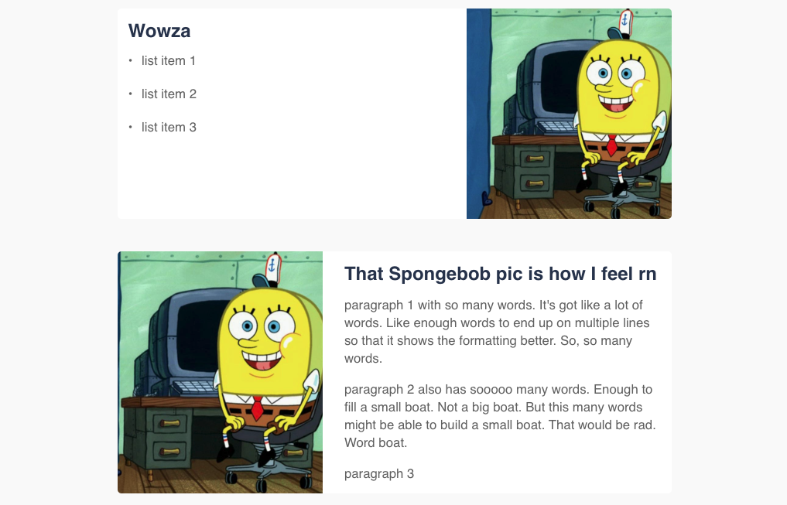

# Practical Solutions For Business Website

This is the react app for the Practical Solutions Inc website. Begun by Andrea Williams in November of 2019.

### *I ACTUALLY PUT EFFORT INTO MAKING THE README HELPFUL*
*please read it*

## Resources / Documentation
- [Semantic UI React](https://react.semantic-ui.com/)
- [React Router Dom](https://reacttraining.com/react-router/web/example/basic)
- [Click this one when you get too frustrated](https://www.reddit.com/r/wholesomememes/)

## File Structure

#### `/containers`

For large container components with many children, such as App.js

#### `/constants`

For components that are present on almost every page, such as the header and footer

#### `/pages`

For components that are specific to a certain route or page

#### `/reusable`

For Components that are mainly stylistic and can change their content in order to be reused within different components/pages

## Navigating CSS files

#### `App.css`
The custom css written entirely by me. Includes workarounds for weird Semantic-UI things, defaults for certain elements, and component-specific styling. Organized **alphabetically**, with the exception of having the general styling before the class styling. The default styles are for mobile, and the media queries are to apply to screens that are tablet and larger.

#### `basic.css`
classes that are really just css shorthands. Very generic and some was copied and pasted from the old site. If there's a class that's abbreviated or doesn't make much sense, it can probably be found here. There are subtitle comments for easier navigation.

#### `index.css`
It's just that one cousin that shows up to all the family functions but doesn't talk to anyone. Is it contributing? who knows. Am I gonna go and tell it to leave? nah

## Custom Styling Components

#### `ImgDiv`
Dynamic component for white divs that have an image on one side.
- **image**: the image for the div. must be required in the parent component i.e. `image={require('path/to/image')}`
- **right**: bool for whether or not the image appears on the right of the text instead of the left. Can be left out or set to false if the image appears to the left
- **list**: an array of list items if the content for the text is an unordered list. If the content is not a list, this prop should be left out
- **paragraphs**: just like the list prop, but with paragraphs instead
- **title**: the title of the text section of the imgdiv

#### `SubHeader`
Section title component that includes a little hr for a lil extra *pizazz*.
- **title**: the text that will go in the component
- **marginTop**: adds a margin-top of 3rem
- **marginBottom**: adds a margin-bottom of 3rem
- **paddingTop**: adds a padding-top of 3rem (best used for light grey sections so that the space above matches the rest of the section)

#### `LoneParagraph`
Text section that has no title, but the first paragraph is a drop cap.
- **text**: an array of paragraphs for the component

#### `IconParagraph`
Small section for Icons with accompanying text.
- **iconName**: the name of the icon. For this app, iconsmind is used. The class for the span will be "icon-" + iconName to display the correct icon. The full catalog of available icons can be found [here](https://iconsmind.com/view_icons/)
- **title**: the title under the icon
- **content**: the text under the title under the content

---
This project was bootstrapped with [Create React App](https://github.com/facebook/create-react-app).

## Available Scripts

In the project directory, you can run:

### `npm start`

Runs the app in the development mode. 
Open [http://localhost:3000](http://localhost:3000) to view it in the browser.

The page will reload if you make edits. 
You will also see any lint errors in the console.

### `npm test`

Launches the test runner in the interactive watch mode. 
See the section about [running tests](https://facebook.github.io/create-react-app/docs/running-tests) for more information.

### `npm run build`

Builds the app for production to the `build` folder. 
It correctly bundles React in production mode and optimizes the build for the best performance.

The build is minified and the filenames include the hashes. 
Your app is ready to be deployed!

See the section about [deployment](https://facebook.github.io/create-react-app/docs/deployment) for more information.

### `npm run eject`

**Note: this is a one-way operation. Once you `eject`, you can’t go back!**

If you aren’t satisfied with the build tool and configuration choices, you can `eject` at any time. This command will remove the single build dependency from your project.

Instead, it will copy all the configuration files and the transitive dependencies (Webpack, Babel, ESLint, etc) right into your project so you have full control over them. All of the commands except `eject` will still work, but they will point to the copied scripts so you can tweak them. At this point you’re on your own.

You don’t have to ever use `eject`. The curated feature set is suitable for small and middle deployments, and you shouldn’t feel obligated to use this feature. However we understand that this tool wouldn’t be useful if you couldn’t customize it when you are ready for it.

## Learn More

You can learn more in the [Create React App documentation](https://facebook.github.io/create-react-app/docs/getting-started).

To learn React, check out the [React documentation](https://reactjs.org/).

### Code Splitting

This section has moved here: https://facebook.github.io/create-react-app/docs/code-splitting

### Analyzing the Bundle Size

This section has moved here: https://facebook.github.io/create-react-app/docs/analyzing-the-bundle-size

### Making a Progressive Web App

This section has moved here: https://facebook.github.io/create-react-app/docs/making-a-progressive-web-app

### Advanced Configuration

This section has moved here: https://facebook.github.io/create-react-app/docs/advanced-configuration

### Deployment

This section has moved here: https://facebook.github.io/create-react-app/docs/deployment

### `npm run build` fails to minify

This section has moved here: https://facebook.github.io/create-react-app/docs/troubleshooting#npm-run-build-fails-to-minify
